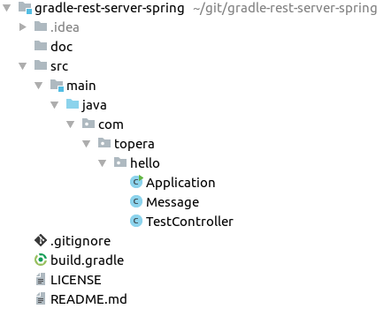

# Topera's Hello World #005
## Rest Server with SpringBoot
This hello world is a Rest Server created with SpringBoot (configured with Gradle)

## How to download this source code
* Install [Gradle](https://gradle.org/install)
* Use the `Clone or download` button above the get the url of this repository
* In IntelliJ IDEA: File → New → Project From Version Control -> Git -> put the url of this repository

## How to test
* `$ cd gradle-rest-server-spring`
* `$ gradle bootRun`
* Access: http://localhost:8080/test

## Tech Stack
* Spring Boot 1.5.6
* IntelliJ IDEA 2016.1.4
* Gradle 3.5.1

## Folder Structure

To see a hello world that generates a WAR file, please check https://github.com/topera/gradle-rest-server-spring-war

To take a look in other projects, please see https://github.com/topera/index
